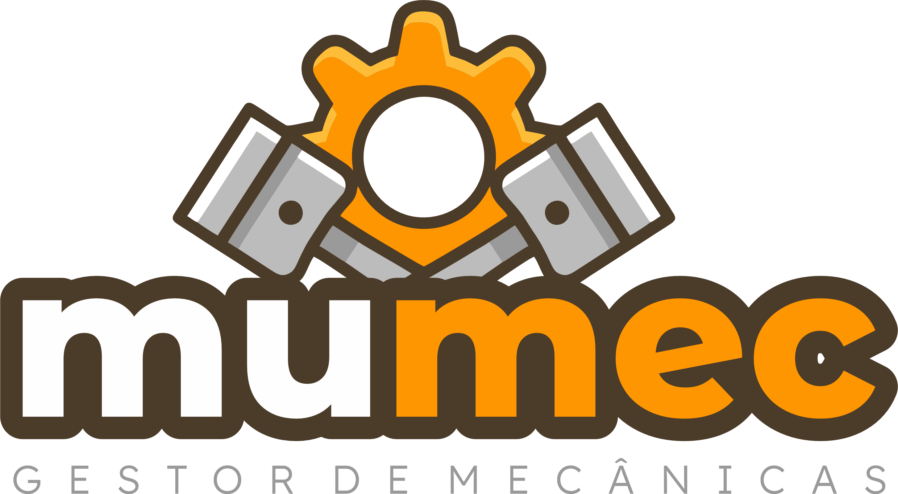

<div align="center">
    
</div>

## MUMEC (Multi Mecânicas)- Gestor de Oficinas Mecânicas multi-plataforma

MUMEC (Multi-Mechanic Management) é uma solução para gerenciar múltiplas oficinas mecânicas, abrangendo serviços para carros, motos e bicicletas. O sistema oferece funcionalidades completas para gerenciamento de produtos, estoque, fluxo de caixa, emisão de pedido de produto e serviços, orçamentos e gerenciamento de clientes e seus veículos.

## 🚀 Funcionalidades (Em desenvolvimento)

- **Autenticação e Autorização**: Autenticação de colaboradores de acordo a unidade.  
- **Emissão de Pedidos**: Cadastro, atualização e acompanhamento do status dos serviços prestados.  
- **Controle de Produtos e Estoque**: Administração de peças, acessórios e insumos utilizados nas oficinas.  
- **Gestão Financeira**: Monitoramento de receitas, despesas e fluxo de caixa.  
- **Cadastro de Clientes e Veículos**: Registro detalhado de clientes, incluindo dados de contato e informações sobre seus veículos.  
- **Suporte a Múltiplas Oficinas**: Cada oficina pode operar de forma independente dentro da mesma plataforma.  

## 🛠 Tecnologias Utilizadas

- **Front-end**: [Vue Js](https://docs.oracle.com/en/java/) com [Quasar Framework](https://spring.io/projects/spring-boot)  
- **Vite**: [PostgreSQL](https://www.postgresql.org/)  

## 📌 Como Executar o Projeto

### Pré-requisitos

- [Node JS](https://docs.oracle.com/en/java/) ou superior instalado;  
- Gerenciador de pacotes [nmv](https://maven.apache.org/);  
- API de gerenciamento de oficinas [ms-oficinas-api](https://github.com/glesiosantos/ms-oficinas-api)

### Instalação e Configuração

```bash
# Clone o repositório
git clone https://github.com/glesiosantos/mumec-app

# Acesse a pasta do projeto
cd mumec-app

# Instale as dependências
usando o NPM install ou yarn

# Inicie a aplicação
npm run dev ou yarn dev
```

## 📖 Documentação da API

A documentação da API pode ser acessada via Swagger na rota `/api-docs` após iniciar o projeto.

## 📜 Licença

Este projeto está licenciado sob a [MIT License](./LICENSE).

## 🤝 Contribuição

Contribuições são bem-vindas! Siga as diretrizes do projeto e envie seu PR.